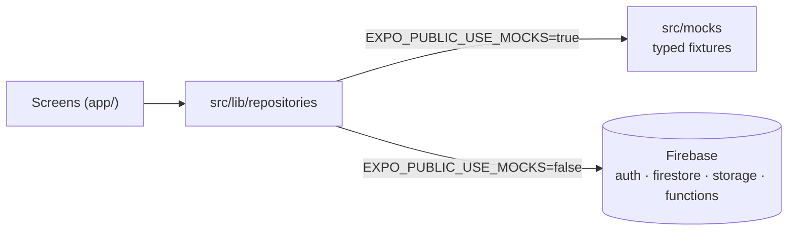
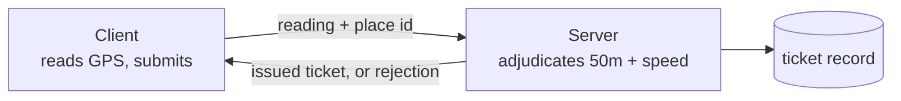
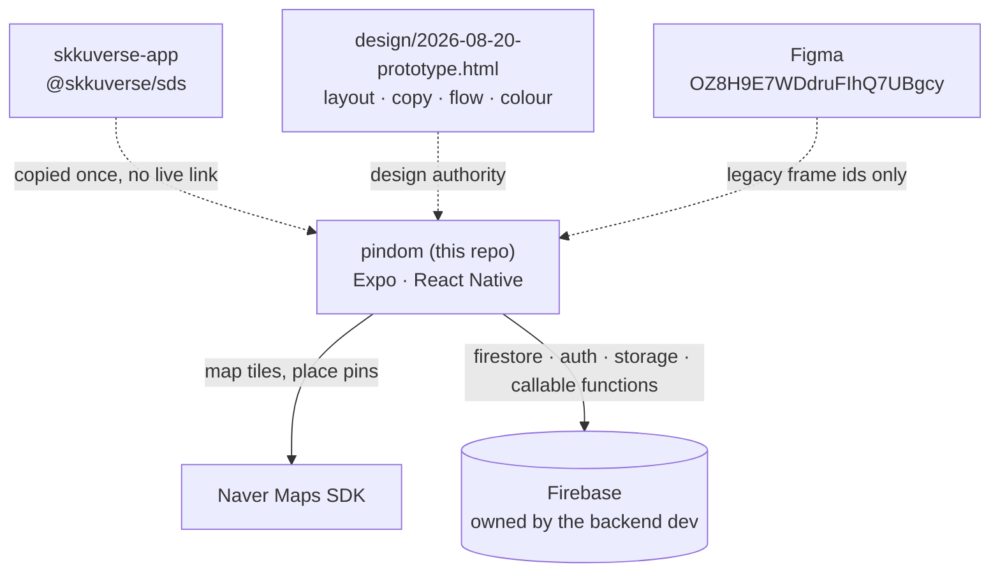

# Architecture Overview

> What PINDOM is, how the repo is laid out, how the app is assembled, and where the trust boundary sits. Written for someone meeting the codebase for the first time.

## What PINDOM is

PINDOM turns *being somewhere* into something you can collect.

A user finds a filming location — the breakwater from a music video, the staircase from a
drama — travels there, and the app **verifies they are physically present**. Only then does
the camera unlock. The photo they take becomes a **ticket**: a proof-of-presence artifact
tied to that place and moment. Tickets accumulate, and are spent entering raffles for
things fans want (concert tickets, signed albums, fansign entry).

The whole product is one loop:

```text
find a place → prove you are there → shoot → mint a ticket → spend tickets → show it off
```

Every screen exists to serve one hop of that loop. When deciding where something belongs,
ask which hop it serves — that is also how the screens are grouped for implementation, in
[../reference/screens.md](../reference/screens.md).

The scarcity is the point. A ticket cannot be farmed from the sofa, which is why
verification is not a formality and why it is designed with an explicit failure path.

## Repo layout

A **flat Expo app**, not a monorepo — the version pins are in `package.json`.

| Path | Role |
| --- | --- |
| `app/` | Expo Router routes. File tree *is* the navigation graph |
| `src/design-system/` | The vendored design system. Owned by this repo, not a dependency |
| `src/lib/api/` | Superseded by [ADR 0005](../decisions/0005-keep-firebase-behind-a-repository-boundary.md), except `types.ts` — the `Result` envelope and failure taxonomy |
| `src/lib/domain/` | Domain types, mirroring [../reference/backend-contract.md](../reference/backend-contract.md) |
| `src/lib/repositories/` | The data boundary. The only code that talks to Firebase |
| `src/mocks/` | Typed fixtures the repositories serve when `EXPO_PUBLIC_USE_MOCKS` is on |
| `src/lib/config.ts` | The only reader of `Constants.expoConfig.extra` |
| `src/lib/store/` | MMKV-backed persistence adapters for Zustand |
| `src/components/` | App-level shared components, above the design system. Empty since the last skeleton was replaced — what the screens share so far is feature-level and lives in `src/features/shared/` |
| `src/features/` | Feature-scoped code |
| `assets/` | Images and (eventually) fonts |
| `design/` | The interactive prototype — the design authority. See [../../design/README.md](../../design/README.md) |

Dependencies run **one way**: `app/` → `src/features/` → `src/components/` →
`src/design-system/`. The design system must never import from a screen; the moment it
does, it stops being reusable and becomes a second copy of the app.

The design system was copied from skkuverse rather than depended on. That decision, and
what it costs, is [ADR 0002](../decisions/0002-vendor-sds-instead-of-dependency.md).

## The provider stack

In `app/_layout.tsx`. The order is a set of constraints, not a preference.

```text
GestureHandlerRootView → SafeAreaProvider → SDSProvider → Stack
```

- **GestureHandlerRootView** must be the outermost native view. Below it, bottom sheets and
  `Pressable` gestures stop responding — silently, with no error.
- **SafeAreaProvider** measures insets at the root. Design-system components call
  `useSafeAreaInsets()`; without this they read zeroes and draw under the notch.
- **SDSProvider** supplies the theme seed every accent-coloured component derives from. It
  is deliberately given no `token` override here — passing one would re-theme the entire
  app. See [ADR 0003](../decisions/0003-single-seed-theming.md).
- **Stack** is the Expo Router root.

## Navigation

Five tabs — 지도 · 커뮤니티 · 홈 · 티켓 · 마이 — with 홈 as the initial route, wrapped in a
root stack that carries the non-tab flows (auth, capture, raffle, post).

The full graph, including both decision points and their failure edges, is drawn in
[../reference/screens.md](../reference/screens.md). It is derived from the 플로우차트 frame
(`30:2`), which is the closest thing this project has to a product spec.

Two route-shape notes worth knowing:

- The community write screen is `/post/write`, **not** `/community/write`, because the
  latter would share a URL namespace with the 커뮤니티 tab.
- `/place/[id]` and `/raffle/[id]` are dynamic; everything else is static.

## Data flow

The backend is **Firebase, owned by the backend developer** — project, schema, rules,
functions and billing. This repo is a client of it, and reaches it through exactly one
directory.



- **`src/lib/repositories/` is the only code that imports Firebase.** Both branches return the
  same `Result<T>`, so a screen cannot tell which one is running. The Firebase side is loaded
  by a dynamic import, so fixture mode never executes a line of it — which is what lets the
  app build before the platform config files arrive. See
  [ADR 0005](../decisions/0005-keep-firebase-behind-a-repository-boundary.md).
- **`src/lib/api/` is superseded**, except `types.ts`. The axios client, its interceptor chain
  and the provisional `endpoints.ts` describe a REST server that is not being built. `Result<T>`
  and the failure taxonomy survive as the convention repositories return.
- **Only three operations are server-side code.** Security rules have no `sqrt` and no
  trigonometry, so `verifyLocation`, `issueTicket` and `enterRaffle` are Cloud Functions.
  Everything else is direct Firestore access guarded by rules.
- **Firestore enforces no schema**, so the field names the two codebases agree on live in
  [../reference/backend-contract.md](../reference/backend-contract.md). That document is the
  referee, because nothing in either codebase will catch a mismatch.

Until the Firebase project is reachable, screens bind to typed fixtures. How to join the
project — and how to work before you can — is in
[../how-to/connect-the-app-to-firebase.md](../how-to/connect-the-app-to-firebase.md).

## Trust boundary

This is the part of the architecture most likely to be got wrong, so it is stated plainly.

**The client must never decide whether a verification passed.**

GPS인증 submits a reading and the server judges it on four gates: the reported accuracy is
tight enough to mean anything, the device did not flag the position as mocked, the user is
within the place's radius, and the implied speed since the last reading is plausible. The
last exists purely to defeat location spoofing — the design says so out loud, labelling the
row `이동속도 검증 (스푸핑 방지)`. The thresholds are in
[../reference/backend-contract.md](../reference/backend-contract.md).

Every one of them is trivially bypassed if the client is the authority: a spoofed coordinate
and a patched build are all it takes, and the reward is a ticket with real value attached.
The client's job is to **collect a reading and submit it**. The server decides, issues the
ticket, and is the only thing that may write a ticket record.



Treat the on-screen radius and countdown as **feedback**, not as the check.

## System boundaries



The dotted edges matter: neither Figma nor skkuverse is a runtime dependency. The design
system was copied at a point in time and diverges freely; upstream fixes do not arrive.

## Related

- [design-language.md](design-language.md) — why the screens look the way they do
- [../how-to/connect-the-app-to-firebase.md](../how-to/connect-the-app-to-firebase.md) — joining the Firebase project, and building before you can
- [../reference/backend-contract.md](../reference/backend-contract.md) — the Firestore collections and Cloud Function signatures
- [../reference/screens.md](../reference/screens.md) — the navigation graph and screen map
- [../decisions/](../decisions/) — the structural decisions behind all of this
- [../README.md](../README.md) — docs index and writing rules
