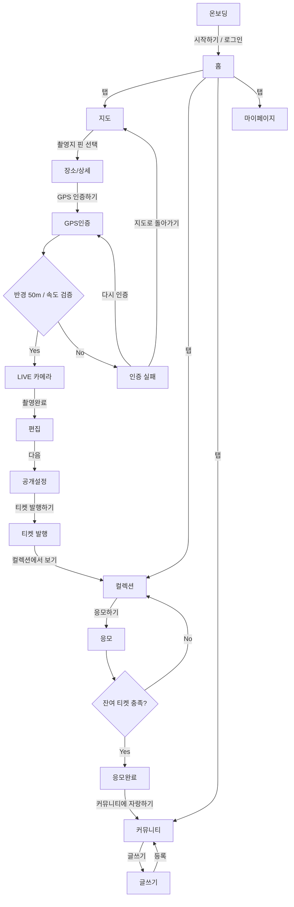

# Screen Inventory

> Every Figma frame mapped to its node id, theme, route and build status, plus the order to build them in. The lookup table for any screen work.

## Summary

The design file is `OZ8H9E7WDdruFIhQ7UBgcy`, one page (`0:1`), split into two sections.

- **Section 2 (`41:65`) is the real app** — the designed screens, plus the flowchart.
- **Section 1 (`9:8`) is abandoned scratch work** — see the warning below.

The tables below are the source of record for which frames exist; count them there rather
than repeating a total anywhere else.

Frame URLs follow this shape, with `:` in a node id written as `-`:

```text
https://www.figma.com/design/OZ8H9E7WDdruFIhQ7UBgcy/PINDOM?node-id=33-2617&m=dev
```

Status values: `skeleton` (route exists, placeholder body) · `variant` (a state of another
screen, not its own route) · `built` (implemented against the design).

## Section 2 — the real app

| Frame | Node | Theme | Route | Status |
| --- | --- | --- | --- | --- |
| 플로우차트 | `30:2` | — | *(flow diagram, not a screen)* | reference |
| 시작화면 | `33:2801` | dark | `/login` | skeleton |
| 홈 | `33:2617` | light | `/(tabs)/index` | skeleton |
| 지도 | `33:2460` | light | `/(tabs)/map` | skeleton |
| 장소/상세 | `33:2381` | light | `/place/[id]` | skeleton |
| GPS인증 | `33:2330` | dark | `/verify/gps` | skeleton |
| GPS인증2 | `33:2856` | dark | `/verify/gps` | variant — same layout at 32m instead of 84m |
| 인증 실패 | `33:2293` | light | `/verify/failed` | skeleton |
| 카메라 | `33:2230` | dark | `/capture/camera` | skeleton |
| 편집 | `33:2166` | dark | `/capture/edit` | skeleton |
| 공개설정 | `33:2120` | light | `/capture/visibility` | skeleton |
| 티켓 발행 | `33:2072` | dark | `/capture/issued` | skeleton |
| 컬렉션 | `33:1961` | light | `/(tabs)/tickets` | skeleton |
| 응모 | `33:1871` | light | `/raffle/[id]` | skeleton |
| 응모완료 | `33:1830` | dark | `/raffle/done` | skeleton |
| 커뮤니티 | `33:1717` | light | `/(tabs)/community` | skeleton |
| 커뮤니티 2 | `33:2922` | light | `/(tabs)/community` | variant — the populated feed |
| 글쓰기 | `33:1686` | light | `/post/write` | skeleton |
| 마이페이지 | `33:1597` | light | `/(tabs)/my` | skeleton |

### How theme was determined

Each frame was rendered and its mean luminance measured, then confirmed by eye. The two
camera-based screens needed the eye check: 카메라 and 편집 both measure near the
light/dark boundary because a large bright photograph dominates the frame, while their
**chrome** — bars, controls, background — is dark. Classify by chrome, not by average.

### Undesigned route

`/onboarding` exists in the flowchart (온보딩 → 시작하기 / 로그인) but **has no Figma
frame**. It is a real gap, not an oversight in this table.

## Section 1 — abandoned

> [!WARNING]
> Figma's `Ready for dev` tag is applied to **Section 1**, which is wrong. Section 1 holds
> six crude wireframes, three of them completely empty. Any tooling or prompt that selects
> frames by that tag will pull the wrong ones. Ignore the tag, or retag Section 2.

| Frame | Node | Note |
| --- | --- | --- |
| 시작화면 | `1:2` | Superseded by `33:2801` |
| 1 | `2:2` | Rough |
| 2 | `2:3` | Rough; carries an obsolete nav draft (`HOME/PINMAP/COMMU/COLLECTION/MYPAGE`) |
| 3 | `2:4` | Empty |
| 4 | `2:5` | Empty |
| 5 | `2:6` | Empty |

## Flow slices

Build one slice per session. Screens inside a slice **share state and navigation params**;
building them apart is how three incompatible route signatures happen.

| Slice | Screens | Shared state |
| --- | --- | --- |
| Auth & entry | 시작화면 *(온보딩 undesigned)* | auth session |
| Discovery | 홈, 지도, 장소/상세 | place list and detail, geo position |
| Capture | GPS인증, GPS인증2, 인증 실패, 카메라, 편집, 공개설정, 티켓 발행 | `placeId`, verification result, draft photo |
| Tickets & raffle | 컬렉션, 응모, 응모완료 | ticket balance, `raffleId` |
| Community | 커뮤니티, 커뮤니티 2, 글쓰기 | feed page, draft post |
| Profile | 마이페이지 | user |

> [!NOTE]
> Slice membership follows the flowchart (`30:2`), not the visual grouping on the canvas.
> 공개설정 belongs to Capture because it sits between 편집 and 티켓 발행, even though it
> looks like a settings screen. 편집 and 카메라 are Capture for the same reason.

## The navigation graph

Taken from 플로우차트 (`30:2`). Two decision points, both with designed failure paths.



## Related

- [figma-workflow.md](figma-workflow.md) — how to pull a frame without getting burned
- [design-system.md](design-system.md) — the components to build these with
- [../plans/screen-implementation.md](../plans/screen-implementation.md) — the build order
- [../explanation/design-language.md](../explanation/design-language.md) — why the theme column looks like that
