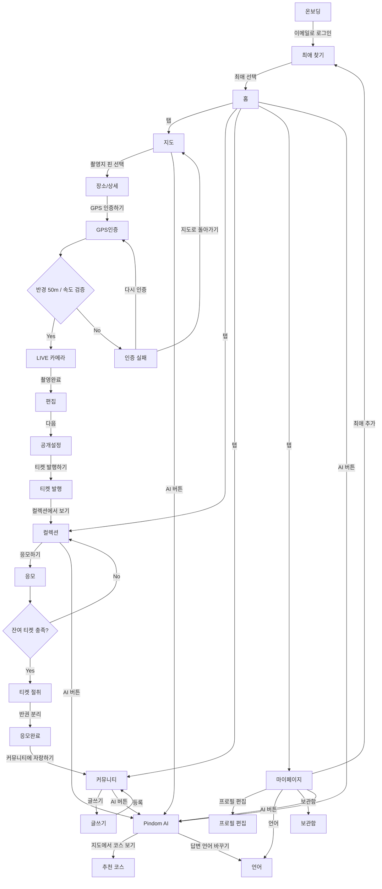

# Screen Inventory

> Every Figma frame mapped to its node id, theme, route and build status, plus the order to build them in. The lookup table for any screen work.

## Summary

**The prototype is the inventory.** `design/2026-08-20-prototype.html` block `1a` contains the
screens PINDOM builds; see [`design/README.md`](../../design/README.md) and
[ADR 0006](../decisions/0006-adopt-the-prototype-as-the-design-source-of-truth.md). The Figma
file is kept for traceability only — its node ids remain the addressable names for frames that
predate the prototype, and the abandoned section below is still worth a warning.

Every screen is dark. The `2b` direction is a single dark surface applied throughout, so the
light/dark split the earlier frames had no longer exists — see
[../explanation/design-language.md](../explanation/design-language.md).

Count the screens in the table rather than repeating a total anywhere else.

Frame URLs follow this shape, with `:` in a node id written as `-`:

```text
https://www.figma.com/design/OZ8H9E7WDdruFIhQ7UBgcy/PINDOM?node-id=33-2617&m=dev
```

Status values: `skeleton` (route exists, placeholder body) · `missing` (no route yet) ·
`variant` (a state of another screen, not its own route) · `built` (implemented against the
prototype).

## Screens

`Screen` is the prototype's own identifier — the value it switches on — so it is the fastest
way to find a screen in the file. Routes marked *proposed* have no file yet; they follow the
existing rule that a non-tab flow must not share a URL namespace with a tab, which is why
profile, language and vault sit at the root rather than under `/my`.

| Screen | Frame | Node | Route | Status |
| --- | --- | --- | --- | --- |
| `onboard` | 온보딩 + 시작화면 | `33:2801` | `/onboarding` | skeleton — **absorbs 시작화면**; email sign-in is folded in |
| `artistSearch` | 최애 찾기 | — | `/artist/search` *(proposed)* | **missing** |
| `home` | 홈 | `33:2617` | `/(tabs)/index` | **built** — the reference screen; match it |
| `map` | 지도 | `33:2460` | `/(tabs)/map` | **built** — pins + 촬영지 목록; needs a Naver client id |
| `place` | 장소/상세 | `33:2381` | `/place/[id]` | **built** — with 갤러리 and 촬영 팁 |
| `verify` | GPS인증 | `33:2330`, `33:2856` | `/verify/gps` | **built** — `1b`-A 레이더; the verdict is the server's |
| `fail` | 인증 실패 | `33:2293` | `/verify/failed` | **built** — four reasons onto `1a`'s two kinds |
| `camera` | 카메라 | `33:2230` | `/capture/camera` | **built** — live view + cutout; stand-in without a camera |
| `edit` | 편집 | `33:2166` | `/capture/edit` | **built** — composes the print; 모자이크 only |
| `publish` | 공개설정 | `33:2120` | `/capture/visibility` | **built** — no caption field in the contract |
| `issued` | 티켓 발행 | `33:2072` | `/capture/issued` | **built** — `TicketCard` with a real Code 128 |
| `collection` | 컬렉션 | `33:1961` | `/(tabs)/tickets` | **built** — balance, tier gauge, ticket tiles |
| `raffle` | 응모 | `33:1871` | `/raffle/[id]` | **built** — every open raffle, `[id]` selected |
| `tear` | 티켓 절취 | — | `/raffle/tear` | **built** — the 반권 mechanic; one `enterRaffle` at the end |
| `done` | 응모완료 | `33:1830` | `/raffle/done` | **built** — torn halves, entry number |
| `community` | 커뮤니티 | `33:1717`, `33:2922` | `/(tabs)/community` | skeleton — now **per-artist boards** |
| `write` | 글쓰기 | `33:1686` | `/post/write` | skeleton |
| `chat` | Pindom AI | — | `/chat` *(proposed)* | **missing** — assistant; the model call is the backend's, see below |
| `course` | 추천 코스 | — | `/course` *(proposed)* | **missing** — reachable only from `chat` |
| `my` | 마이페이지 | `33:1597` | `/(tabs)/my` | skeleton |
| `profile` | 프로필 편집 | — | `/profile` *(proposed)* | **missing** |
| `language` | 언어 | — | `/language` *(proposed)* | **missing** |
| `vault` | 보관함 | — | `/vault` *(proposed)* | **missing** — private tickets |

### What changed against the Figma frames

- **`/login` is gone.** 시작화면 (`33:2801`) is absorbed into 온보딩; email sign-in happens
  there. Delete `app/login.tsx` when 온보딩 is built.
- **`/onboarding` is no longer undesigned.** It was previously a real gap — flowchart only,
  no frame. The prototype designs it.
- **Five screens are new**, with no frame behind them: `artistSearch`, `tear`, `profile`,
  `language`, `vault`. The `2026-08-20` drop added two more, below.
- **장소/상세 grew** a photo gallery, a review list with tier badges and likes, and a stats
  row (인증 · 사진 · 거리).
- **커뮤니티 is now segmented by artist.** Posts carry a board id; the feed is per 최애, not
  global.
- **홈 has four blocks, not three.** 마감 임박 응모, {최애}의 촬영지 and {최애} 지역 코스 sit under
  the 보유 티켓 summary. The 지역 코스 block is easy to miss — it is below the fold in `1a` and
  absent from `2b`'s mockup, which shows only the first two.

> [!NOTE]
> The prototype's 마이페이지 has a global light/dark toggle. It is **not** adopted — see
> [ADR 0006](../decisions/0006-adopt-the-prototype-as-the-design-source-of-truth.md). Do not
> build a theme setting.

### What the 2026-08-20 drop added

The drop is additive against the one before it. Block `2b` is byte-identical and blocks `1b`,
`1c` and `1d` are untouched, so no colour, type, corner or variant decision moved.

- **Two screens are new**, `chat` and `course`, both in the table above.
- **A floating assistant button** sits on the five tabbed screens — 홈, 지도, 컬렉션,
  커뮤니티, 마이페이지 — and is the only way into `chat`. `course` is in turn reachable only
  from `chat`, through a 지도에서 코스 보기 card the assistant surfaces after a route answer.
- **편집 tightened.** The cutout scale slider narrowed from 50–150% to 88–112%, reads
  원본 비율 at exactly 100, and the 좌우반전 button is gone. Build the narrowed range; the
  open question about why is in [`design/README.md`](../../design/README.md).
- **The assistant's copy ships in ko, en, ja and zh.** That question is now settled the other
  way: the app ships `ko` and `en` only, and the prototype's extra two are read as absent at the
  repository boundary. See the
  [review resolutions](../plans/2026-08-21-backend-contract-review-resolutions.md).

> [!IMPORTANT]
> **Nothing in this repo calls a model API.** The prototype's assistant makes its own model
> call, but that is prototype scaffolding, not the design. The answers, the route behind
> 지도에서 코스 보기, and 답변 신고하기 are all the backend's, reached through
> `src/lib/repositories/` like every other data source
> ([ADR 0005](../decisions/0005-keep-firebase-behind-a-repository-boundary.md)). `chat`
> submits a message and renders what comes back — it does not pick a provider, hold a key, or
> build a prompt.

## Section 1 — abandoned

> [!WARNING]
> Figma's `Ready for dev` tag is applied to **Section 1**, which is wrong. Section 1 holds
> six crude wireframes, three of them completely empty. Any tooling or prompt that selects
> frames by that tag will pull the wrong ones. Ignore the tag, or retag Section 2.

| Frame | Node | Note |
| --- | --- | --- |
| 시작화면 | `1:2` | Superseded by `33:2801` |
| 1 | `2:2` | Rough |
| 2 | `2:3` | Rough; carries an obsolete nav draft (`HOME/PINMAP/COMMU/COLLECTION/MYPAGE`) |
| 3 | `2:4` | Empty |
| 4 | `2:5` | Empty |
| 5 | `2:6` | Empty |

## Flow slices

Build one slice per session. Screens inside a slice **share state and navigation params**;
building them apart is how three incompatible route signatures happen.

| Slice | Screens | Shared state |
| --- | --- | --- |
| Auth & entry | 온보딩, 최애 찾기 | auth session, followed artists |
| Discovery | 홈, 지도, 장소/상세 | place list and detail, geo position, selected artist |
| Capture | GPS인증, 인증 실패, 카메라, 편집, 공개설정, 티켓 발행 | `placeId`, verification session and grant, draft photo |
| Tickets & raffle | 컬렉션, 응모, 티켓 절취, 응모완료 | ticket balance, tier, `raffleId` |
| Community | 커뮤니티, 글쓰기 | board (artist), feed page, draft post |
| Profile | 마이페이지, 프로필 편집, 언어, 보관함 | user, followed artists, vault |
| Assistant | Pindom AI, 추천 코스 | selected artist, conversation history, the course the answer produced |

> [!NOTE]
> Slice membership follows the flow, not the visual grouping. 공개설정 belongs to Capture
> because it sits between 편집 and 티켓 발행, even though it looks like a settings screen.
> 편집 and 카메라 are Capture for the same reason. 최애 찾기 belongs to Auth & entry because
> picking an artist is part of first run — the rest of the app is keyed to that choice.

## The navigation graph

Taken from the prototype. The 플로우차트 frame (`30:2`) is the earlier version of the same
graph; where they differ, the prototype is right. Two decision points, both with designed
failure paths.



## Related

- [`design/README.md`](../../design/README.md) — the prototype these screens come from
- [../plans/2026-08-22-discovery-slice-checklist.md](../plans/2026-08-22-discovery-slice-checklist.md) — how the Discovery slice was built, and where its two sources disagreed
- [../plans/2026-08-22-capture-slice-checklist.md](../plans/2026-08-22-capture-slice-checklist.md) — how the Capture slice was built, and what the device run found
- [../plans/2026-08-22-tickets-slice-checklist.md](../plans/2026-08-22-tickets-slice-checklist.md) — how the Tickets & raffle slice was built, and where the tier gauge and the contract disagree
- [ADR 0006](../decisions/0006-adopt-the-prototype-as-the-design-source-of-truth.md) — why the prototype outranks Figma
- [design-tokens.md](design-tokens.md) — the `2b` surface these are drawn on
- [design-system.md](design-system.md) — the components to build these with
- [figma-workflow.md](figma-workflow.md) — how to pull an older frame without getting burned
- [../plans/screen-implementation.md](../plans/screen-implementation.md) — the build order
- [../explanation/design-language.md](../explanation/design-language.md) — why the theme column looks like that
